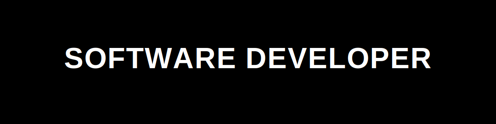

<!-- ========================================================= -->
<!--               ATHARV HOLKAR - GITHUB PROFILE              -->
<!-- ========================================================= -->

<h1 align="center">
  
</h1>

<p align="center">



</p>

<p align="center">

<a href="https://github.com/Atharv-mu">

</a>

<a href="https://github.com/Atharv-mu?tab=followers">

</a>


</p>

---

# 👨‍💻 About Me

```yaml
Name: Atharv Holkar

Role: Full Stack Developer

Education:
  B.Tech Computer Science Engineering
  Third Year
  Medi-Caps University

Location:
  Indore, Madhya Pradesh 🇮🇳

Currently Learning:
  • MERN Stack
  • Backend Development
  • Data Structures & Algorithms
  • System Design

Looking For:
  Software Development Internship (2026)

Interests:
  • Web Development
  • Open Source
  • Problem Solving
```

---

# 💻 Terminal

```bash
> whoami

Atharv Holkar

> role

Full Stack Developer

> education

Third Year B.Tech CSE

> university

Medi-Caps University

> current_status

🟢 Available For Internship

> location

Indore, India

> tech

React
Node.js
Express
MongoDB
Java
JavaScript
Python

> life

Eat 🍕
Code 💻
Sleep 😴
Repeat 🔁
```

---

# 🎯 Career Objective

I'm a **Third-Year Computer Science Engineering student** at **Medi-Caps University** with a strong interest in **Full Stack Development**.

I enjoy building scalable web applications using the **MERN Stack**, solving **Data Structures & Algorithms** problems, and continuously learning modern software engineering practices.

# 🛠️ Tech Stack

### 💻 Programming Languages

<p align="center">

</p>

### 🌐 Frontend Development

<p align="center">

</p>

### ⚙️ Backend Development

<p align="center">

</p>

### 🧰 Tools & Technologies

<p align="center">

</p>

---

# 🚀 Featured Projects

## 🌍 Smart Tourism

A tourism platform that helps users discover destinations, explore attractions, and plan trips with a modern and responsive interface.

**Tech Stack**

- HTML
- CSS
- JavaScript

---

## 💼 Lead Finder

A web application that helps businesses discover and manage potential customer leads efficiently.

**Tech Stack**

- JavaScript
- HTML
- CSS

---

## 🌐 Personal Portfolio

My personal developer portfolio showcasing my projects, skills, resume, and contact information.

**Tech Stack**

- React.js
- Tailwind CSS
- JavaScript

---

# 📚 Currently Learning

- 🚀 Advanced MERN Stack
- 📦 Backend Architecture
- ☁️ REST APIs
- 🧠 Data Structures & Algorithms
- ⚡ System Design Basics

---

# 🎯 2025 Goals

- ✅ Master MERN Stack
- ✅ Build 10+ Real-World Projects
- ✅ Solve 500+ DSA Problems
- ✅ Contribute to Open Source
- ✅ Get a Software Development Internship
- ✅ Improve Problem Solving Skills

---

# 💡 Fun Fact

```text
while(alive)
{
    eat();
    code();
    learn();
    sleep();
    repeat();
}
```

---
# 📊 GitHub Statistics

<p align="center">
  
  
  
</p>

---

# 🔥 GitHub Streak

<p align="center">
  
</p>

---

# 📈 Contribution Graph

<p align="center">
  
</p>

---

# 🏆 GitHub Trophies

<p align="center">
  
</p>

---

# 👀 Profile Visitors

<p align="center">
  
</p>

---

# ⚡ GitHub Highlights

<div align="center">

| 📌 | Information |
|:--:|-------------|
| 🎓 | Third Year B.Tech CSE Student |
| 🏫 | Medi-Caps University |
| 💻 | Full Stack Developer |
| 🚀 | MERN Stack Enthusiast |
| 🌱 | Currently Learning Backend & System Design |
| 💼 | Open to Software Development Internship (2026) |
| 📍 | Indore, Madhya Pradesh |

</div>

---

# 💻 Coding Philosophy

```cpp
while (!success)
{
    learn();
    build();
    debug();
    repeat();
}
```

---

# 🌟 Current Focus

- 🚀 Full Stack Development
- ⚛️ React Ecosystem
- 🟢 Node.js & Express
- 🍃 MongoDB
- 📚 DSA (Java)
- ☁️ REST APIs
- ⚡ System Design Basics

---

# 📅 2025 Roadmap

✔ Build Production Ready Projects

✔ Master MERN Stack

✔ Learn Deployment (AWS/Vercel/Render)

✔ Solve 500+ DSA Problems

✔ Contribute to Open Source

✔ Crack a Product Based Company Internship 🚀

---
---

# 🌐 Connect With Me

<p align="center">

<a href="https://linkedin.com/in/atharvholkar" target="_blank">

</a>

<a href="mailto:atharvholkar41@gmail.com">

</a>

<a href="https://atharvholkarportfolio.netlify.app">

</a>

<a href="https://github.com/Atharv-mu">

</a>

</p>

---

# 💼 Why Hire Me?

✔ Passionate Full Stack Developer

✔ Strong MERN Stack Fundamentals

✔ Quick Learner & Adaptable

✔ Good Team Player

✔ Strong Problem Solving Skills

✔ Focused on Writing Clean & Maintainable Code

✔ Always Learning New Technologies

✔ Open to Software Development Internship (2026)

---

# 📜 Certifications

- 🎓 Web Development Certification
- 💻 Java Programming
- 🌐 Frontend Development
- 🚀 Currently pursuing advanced MERN Stack projects

> *(Replace these with your actual certificates as you earn them.)*

---

# 🏅 Achievements

- 🎓 Third Year B.Tech CSE Student
- 💻 Built multiple Full Stack & Frontend Projects
- 🌍 Developed **Smart Tourism** Project
- 💼 Created **Lead Finder** Web Application
- 🌐 Designed & Deployed Personal Portfolio
- 📚 Continuously improving DSA and Backend skills

---

# 📈 Currently Working On

```text
🚀 MERN Stack Development

📚 Data Structures & Algorithms

⚡ Backend APIs

☁️ Deployment & Cloud

🧠 System Design Basics
```

---

# ❤️ Support

If you like my work, don't forget to ⭐ my repositories.

Your support motivates me to build more amazing projects.

---

# 💬 Favorite Quote

> **"Code is like humor. When you have to explain it, it's bad."** — Cory House

---

# 📩 Contact Me

📧 **Email:** atharvholkar41@gmail.com

💼 **LinkedIn:** https://linkedin.com/in/atharvholkar

🌐 **Portfolio:** https://atharvholkarportfolio.netlify.app

---

# ⚡ Fun Fact

```javascript
const atharv = {
    code: true,
    coffee: true,
    bugs: true,
    debugging: "Never Give Up 🚀",
    learning: "Every Single Day"
};
```

---
---

# 🐍 Contribution Snake

> The snake animation will start working after adding the GitHub Action workflow.

<p align="center">
  
</p>

---

# 📈 Developer Dashboard

<div align="center">

| 🚀 Status | Value |
|-----------|-------|
| 🎓 Education | Third Year B.Tech CSE |
| 🏫 University | Medi-Caps University |
| 💻 Role | Full Stack Developer |
| 🌱 Learning | MERN Stack + DSA |
| 💼 Looking For | Software Development Internship |
| 📍 Location | Indore, Madhya Pradesh |

</div>

---

# 🛠 Development Workflow

```text
💡 Idea
   │
   ▼
📋 Planning
   │
   ▼
💻 Coding
   │
   ▼
🐞 Debugging
   │
   ▼
🚀 Deployment
   │
   ▼
📈 Improvement
```

---

# 📅 2026 Goals

- 🎯 Secure a Software Development Internship
- 🚀 Master MERN Stack
- 📚 Solve 500+ DSA Problems
- ☁️ Learn AWS & Docker
- 🌍 Contribute to Open Source
- 🏆 Build Production-Ready Projects

---

# 💙 Thanks for Visiting

<p align="center">

If you enjoyed my projects or found my work helpful,
consider giving a ⭐ to my repositories.

It motivates me to keep learning and building.

</p>

---

# 🌟 Let's Build Something Amazing Together

<p align="center">


</p>

---

<p align="center">


</p>

<div align="center">

### ⭐ Made with ❤️ by Atharv Holkar

**"Keep Learning • Keep Building • Keep Growing 🚀"**

</div>

🚀 **Currently seeking Software Development Internship opportunities for 2026.**

---
