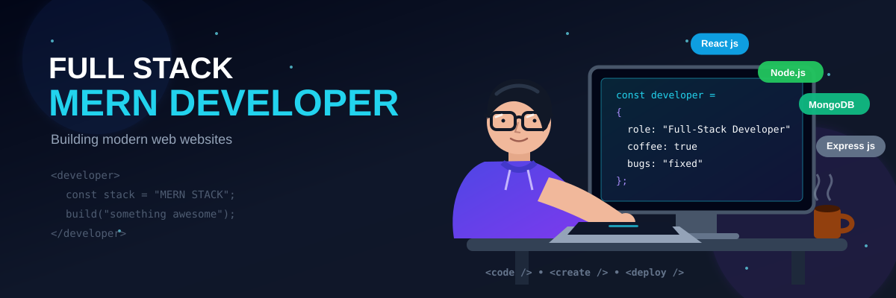

<div align="center">



# 👋 Hey, I'm Atharv Holkar 

## 💻 Full Stack MERN Developer | Decision Maker | Problem Solver

<p>
  <a href="https://github.com/Atharv-mu">
    
  </a>
  <a href="https://www.linkedin.com/in/atharvholkar/">
    
  </a>
  <a href="mailto:atharvholkar41@gmail.com">
    
  </a>
</p>

</div>

---

## 🧑‍💻 About Me

```javascript
const developer = {
    name: "Atharv Holkar",
    role: "Full-Stack MERN Developer",
    location: "India 🇮🇳",

    frontend: [
        "HTML",
        "CSS",
        "JavaScript",
        "React.js",
        "Tailwind CSS"
    ],

    backend: [
        "Node.js",
        "Express.js"
    ],

    database: [
        "MongoDB",
        "SQL"
    ],

    tools: [
        "Git",
        "GitHub",
        "VS Code",
        "Postman"
    ],

    currentlyLearning: [
        "Next.js",
        "TypeScript",
        "System Design"
    ],

    motto: "Build. Learn. Improve. Repeat. 🚀"
};
```

---

## 🚀 Tech Stack

<div align="center">

### 🎨 Frontend


### ⚙️ Backend


### 🗄️ Database


### 🛠️ Tools


</div>

---

## 🔥 What I Build

* 🌐 Full-stack web applications
* ⚛️ Modern React applications
* 🔐 Authentication & authorization systems
* 🔌 RESTful APIs
* 🗄️ MongoDB-powered applications
* 📱 Responsive web interfaces
* ⚡ Scalable backend systems
* 🚀 Production-ready MERN applications

---

## 🐍 Contribution Snake

<div align="center">


</div>

---

## 🌱 Currently Learning

```text
Next.js          ███████████████░░░░░  75%
TypeScript       ███████████████░░░░░  75%
System Design    ███████████░░░░░░░░░  55%
```

---

## 🤝 Let's Connect

<div align="center">

<a href="https://github.com/Atharv-mu">
  
</a>

<a href="https://www.linkedin.com/in/atharvholkar/">
  
</a>

<a href="mailto:atharvholkar41@gmail.com">
  
</a>

</div>

---

<div align="center">

### 💻 Code. 🚀 Build. 🔥 Repeat.

**Thanks for visiting my profile!**

</div>
