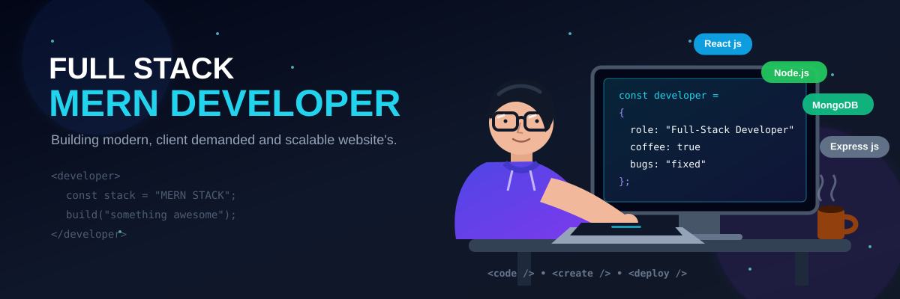

## 👋 Hey, I'm Atharv Holkar

## 💻 Full Stack MERN Developer | Problem Solver

---

##  About Me

Hi, I am Atharv Holkar, a passionate Full-Stack MERN Developer from India. I enjoy building modern, responsive, and scalable web applications that solve real-world problems.

I work primarily with JavaScript, React.js, Node.js, Express.js, and MongoDB, and I enjoy working across both frontend and backend development. From designing clean user interfaces to building RESTful APIs and managing databases, I like understanding the complete development process.

I am a problem solver and decision maker who believes that good development is not just about writing code, but also about choosing the right approach, understanding the problem, and creating solutions that are simple, efficient, and maintainable.

Currently, I am expanding my knowledge of Aptitude, Data Structures, and System Design while working on projects that challenge me to learn and improve.

Outside of writing code, I enjoy exploring new technologies, experimenting with ideas, and continuously improving my development skills.

## View my Latest portfolio, I would love to hear your feedback   

## https://atharv-mu.github.io/Current-portfolio/

---

##  Tech Stacks

###  Frontend

 

### Backend

 

###  Database

 

### Tools

---

##  What I Build

*  **Frontend:** Frontend websites and modern web applications
*  **React:** Modern, responsive React websites
*  **Backend:** Scalable backend systems and RESTful APIs
*  **Authentication:** Authentication & authorization systems
*  **Database:** MongoDB-powered applications
*  **UI/UX:** Responsive and user-friendly web interfaces
*  **Full Stack:** Complete MERN stack applications
*  **Production:** Production-ready web applications

## Contribution Snake

---

## Currently Learning

<pre style="display: inline-block; text-align: left;">
System Design    ███████████████░░░░░  75%
Aptitude         ███████████████░░░░░  75%
Data Structures  ███████████░░░░░░░░░  55%
</pre>

## 🌐 Connect With Me

   
 
